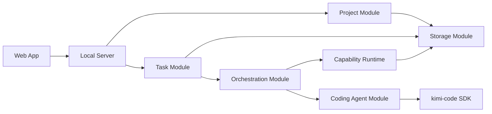

# Babybot Software Architecture

## Repository Boundary

Babybot and kimi-code are separate projects.

- **Babybot** contains the product, project data, Web interface, and task
  orchestration.
- **kimi-code** provides the coding agent used by Babybot.
- Babybot accesses kimi-code through an SDK dependency.
- Babybot does not depend on the internal source structure of kimi-code.

## Modules



### Web App

Provides the user interface:

- project list;
- project workspace;
- conversation and task input;
- progress and execution status;
- documents, code, and other results; and
- project-specific pages.

### Local Server

Runs Babybot and connects the Web App to the product modules.

It provides:

- the local HTTP API;
- task event streaming;
- project page delivery; and
- application startup and shutdown.

### Project Module

Maintains persistent projects.

Each project contains:

- project information;
- goals and current state;
- tasks and conversations;
- artifacts and generated files; and
- project-specific software.

### Task Module

Represents work requested by the user.

It manages:

- task input;
- current task status;
- execution results;
- errors and retries; and
- token usage.

### Orchestration Module

Selects how to complete a task.

It can:

1. produce a direct result;
2. run existing software;
3. combine existing capabilities; or
4. request new software from the Coding Agent Module.

### Capability Runtime

Runs software already available to Babybot.

It manages:

- capability discovery;
- software execution;
- inputs and outputs;
- execution status; and
- capability versions.

### Coding Agent Module

Provides one interface for creating or modifying software.

The first implementation uses the kimi-code SDK. Other coding agents can be
added behind the same module later.

This module manages:

- coding sessions;
- project workspaces;
- coding events;
- approval requests;
- generated files; and
- coding token usage.

### Storage Module

Stores Babybot data locally.

It manages:

- project metadata;
- task and conversation history;
- generated artifacts;
- capability source and versions;
- execution records; and
- configuration.

## Module Dependency

```text
Web App
  -> Local Server
    -> Project Module
    -> Task Module
      -> Orchestration Module
        -> Capability Runtime
        -> Coding Agent Module
          -> kimi-code SDK
    -> Storage Module
```

The Web App communicates only with the Local Server.

The Project and Task modules contain Babybot product state.

The Orchestration Module selects an execution path but does not implement a
specific coding agent.

The Coding Agent Module contains all kimi-code-specific integration.

The Storage Module does not depend on kimi-code.

## Initial Implementation

The first implementation contains:

- Web App;
- Local Server;
- Project Module;
- Task Module;
- Orchestration Module;
- Coding Agent Module with kimi-code;
- Capability Runtime; and
- Storage Module.

Model routing, personal modeling, desktop packaging, and background scheduling
can be added as separate modules later.
