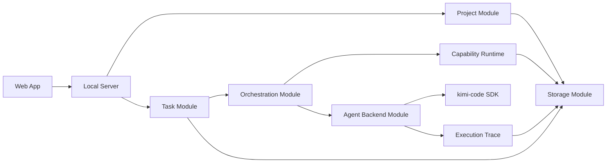
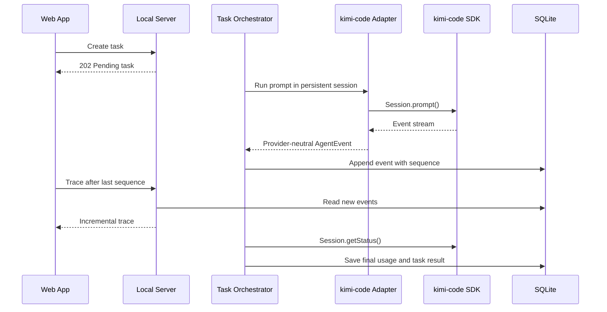
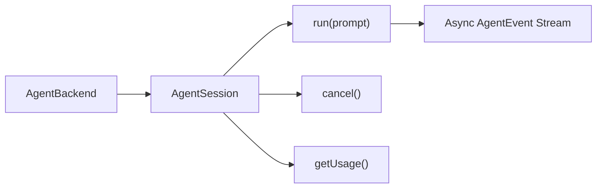

# Babybot Software Architecture

## Repository Boundary

Babybot and kimi-code are separate projects.

- **Babybot** contains the product, project data, Web interface, and task
  orchestration.
- **kimi-code** provides the coding agent used by Babybot.
- Babybot accesses kimi-code through an SDK dependency.
- Babybot does not depend on the internal source structure of kimi-code.

## Modules



### Web App

Provides the user interface:

- project list;
- project workspace;
- conversation and task input;
- progress and execution status;
- an ordered execution trace and token usage;
- documents, code, and other results; and
- project-specific pages.

### Local Server

Runs Babybot and connects the Web App to the product modules.

It provides:

- the local HTTP API;
- first-run provider and model setup;
- task state retrieval;
- incremental trace retrieval;
- project page delivery; and
- application startup and shutdown.

### Project Module

Maintains persistent projects.

Each project contains:

- project information;
- goals and current state;
- tasks and conversations;
- artifacts and generated files; and
- project-specific software.

### Task Module

Represents work requested by the user.

It manages:

- task input;
- current task status;
- execution results;
- errors and retries; and
- detailed model, context, cache, and token usage.

### Orchestration Module

Selects how to complete a task.

It can:

1. produce a direct result;
2. run existing software;
3. combine existing capabilities; or
4. request new software from the Agent Backend Module.

### Capability Runtime

Runs software already available to Babybot.

It manages:

- capability discovery;
- software execution;
- inputs and outputs;
- execution status; and
- capability versions.

### Agent Backend Module

Provides a stable session-oriented interface to the coding agent.

The current implementation uses the kimi-code SDK. The stable contract is
limited to capabilities implemented and tested with kimi-code.

This module manages:

- DeepSeek and OpenRouter provider configuration through kimi-code;
- API-key validation and tool-capable model discovery;
- OpenRouter free-model filtering and compatibility-based recommendation;
- agent session creation and resumption;
- project workspaces;
- streamed message, thinking, and tool events;
- cancellation; and
- token and cache usage.

### Execution Trace

Every translated agent event is assigned a task-local sequence number and
written to SQLite before it is consumed as task output. The trace contains
turns, steps, model status, message and thinking deltas, tool activity, retries,
subagent activity, compaction, warnings, completion, failures, and unrecognized
kimi-code events.



The Babybot trace is the product-facing diagnostic record. kimi-code
`wire.jsonl` and session logs remain the lower-level runtime record. Both use
the same persisted kimi-code session ID for correlation.



Approval, question, background-task, and sandbox APIs are not included until
Babybot implements their complete control flow.

### Model Setup

Babybot never calls the model provider directly for agent execution. The local
setup API passes DeepSeek or OpenRouter credentials to the kimi-code backend,
which validates the key, discovers models, and persists the selected provider
and model alias through `KimiHarness.setConfig()`.

The Babybot API returns only provider name, model ID, and whether a key exists.
It never returns the key. The key is stored in kimi-code's local configuration,
not Babybot's SQLite database. Reconfiguration removes Babybot's saved
kimi-code session references so later tasks start with the new model.

### Storage Module

Stores Babybot data locally.

It manages:

- project metadata;
- task and conversation history;
- generated artifacts;
- capability source and versions;
- execution records;
- ordered agent trace events and detailed usage;
- and configuration.

## Implementation Layout

| Module | Package |
| --- | --- |
| Web App | `apps/web` |
| Local Server | `apps/server` |
| Project and Task Modules | `packages/core` |
| Orchestration Module | `packages/core` |
| Capability Runtime | `packages/capability-runtime` |
| Agent Backend Module | `packages/kimi-code-backend` |
| Storage Module | `packages/storage` |
| Shared HTTP contracts | `packages/contracts` |

The Local Server is the composition root. Core depends only on shared contracts
and provider-neutral interfaces. Storage, capability runtime, and coding
backends implement those interfaces. The Web App communicates only through the
HTTP API.

## Technology

- Node.js 24 and TypeScript;
- pnpm workspaces;
- Fastify local server;
- React and Vite Web App;
- SQLite local storage;
- Vitest tests; and
- oxlint static analysis.

These choices keep Babybot in one language, avoid a separate database service,
and preserve explicit package boundaries without a large framework.

DeepSeek is selected through a model alias configured in kimi-code. Babybot
passes the alias through the Agent Backend Module and does not contain
provider-specific DeepSeek API code.

## Module Dependency

```text
Web App
  -> Local Server
    -> Project Module
    -> Task Module
      -> Orchestration Module
        -> Capability Runtime
        -> Agent Backend Module
          -> kimi-code SDK
    -> Storage Module
```

The Web App communicates only with the Local Server.

The Project and Task modules contain Babybot product state.

The Orchestration Module selects an execution path and consumes the stable
agent event stream.

The Agent Backend Module contains all kimi-code-specific integration.

The Storage Module does not depend on kimi-code.

## Initial Implementation

The first implementation contains:

- Web App;
- Local Server;
- Project Module;
- Task Module;
- Orchestration Module;
- Agent Backend Module with kimi-code;
- Capability Runtime; and
- Storage Module.

Model routing, personal modeling, desktop packaging, and background scheduling
can be added as separate modules later.
