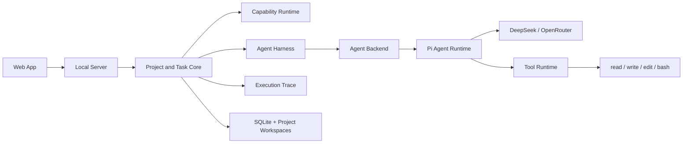
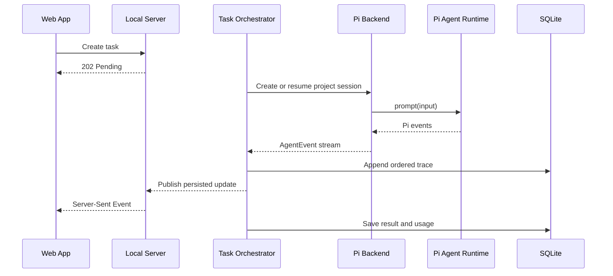
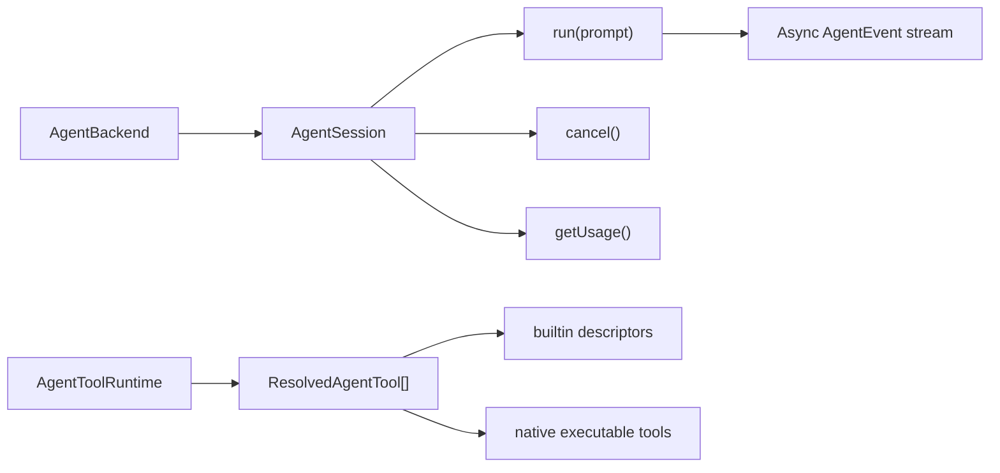

# Babybot Software Architecture

## Ownership

Babybot is the product and control plane. It owns projects, workspaces, tasks,
orchestration, the agent harness, tools, capabilities, execution traces,
credentials, and storage.
Pi is an embedded agent runtime dependency. It owns the model loop, provider
transport, session history, compaction, and built-in coding tool
implementations.

Provider and Pi types do not cross the Agent Backend boundary.

## Modules

### Web App and Local Server

The Web app provides project, task, setup, progress, result, usage, and
technical-trace views. The Fastify server is the composition root and exposes
HTTP plus one project-scoped Server-Sent Events stream.

### Project and Task Core

Core contains product behavior and provider-neutral ports. Each project owns a
workspace and one persistent agent session reference. Tasks are turns executed
against that long-lived project session.

The orchestrator first checks reusable capabilities, then runs the coding
backend. It persists every translated event before publishing it live.

### Pi Agent Backend

`@babybot/pi-backend` embeds Pi through its SDK. It manages:

- isolated Pi configuration under the Babybot data directory;
- DeepSeek and OpenRouter API-key setup;
- model discovery and direct provider diagnostics;
- persistent session creation and restoration;
- one active in-process runtime per saved session;
- streamed message, thinking, step, tool, retry, and compaction events;
- cancellation and token/context usage; and
- translation into Babybot's stable `AgentEvent` protocol.

The old kimi-code adapter remains only as an explicit rollback backend while
the Pi migration is validated.

### Agent Harness

`@babybot/agent-harness` owns provider-neutral agent profiles and system prompt
rendering. The default `general` profile supports direct answers, research,
coding, and mixed tasks. It receives the project identity, workspace, and
resolved tool names at session creation. Pi remains responsible for the model
loop and session history, but runs with Babybot's product identity and
operating contract instead of Pi's default coding-assistant prompt.

Project `AGENTS.md` files are loaded separately as scoped instructions. Dynamic
project memory and task-local context remain future Harness inputs and must not
be conflated with the stable system prompt.

### Tool Runtime

The provider-neutral Tool Runtime resolves tools for a project. Tool sources
are:

- `builtin`: Pi coding tools;
- `native`: Babybot-owned tools;
- `generated`: project-generated tools; and
- `mcp`: external MCP tools.

The current implementation enables Pi's `read`, `write`, `edit`, and `bash`,
plus the Babybot-native `web_fetch` executable tool. `web_search` is enabled
when a Tavily API key is configured. Native tools expose provider-neutral
descriptions, JSON input schemas, and execute functions; the Pi adapter
translates them to Pi custom tools. Generated and MCP tools remain deferred and
must enter through this boundary instead of coupling Core to Pi.
Pi loads project `AGENTS.md` context, while its automatic extension, skill,
prompt-template, and theme discovery is disabled. This prevents a project from
bypassing the Babybot tool registry during the initial migration.

Tools are intentionally not subject to per-call approval inside a
project-owned workspace. The initial runtime is trusted-local. A working
directory and file-path validation do not constrain arbitrary Bash commands,
so host isolation must be added behind a future Project Runtime boundary before
the runtime is described as sandboxed.

### Capability Runtime

Capabilities are reusable workflows selected as a whole-task execution route.
They are distinct from tools invoked inside an agent turn. Generated
capabilities remain untrusted until validation and lifecycle support exist.

### Execution Trace

The Trace contains task-local sequence numbers, session IDs, turns, message and
thinking deltas, tool activity, retries, compaction, warnings, completion,
failures, and unknown runtime events. The main UI may collapse tool details,
but the durable trace remains available for debugging and audit.

### Model Setup and Credentials

The setup API supports DeepSeek and OpenRouter API keys. Pi credentials are
stored in `.babybot/pi/auth.json` with owner-only permissions. Selected model
metadata and session JSONL files also remain under `.babybot/pi`. SQLite stores
only redacted catalogs, Babybot session references, tasks, and traces.

The direct chat diagnostic calls the selected provider with a fixed short
prompt and does not create a Pi session. It distinguishes provider/account
failures from runtime failures without returning credentials.

## Stable Contracts

Backend contract tests cover event translation, persistent session reuse,
cancellation, token accounting, and tool resolution.

## Implementation Layout

| Module | Package |
| --- | --- |
| Web App | `apps/web` |
| Local Server | `apps/server` |
| Project, Task, and Orchestration Core | `packages/core` |
| Agent profiles and system prompts | `packages/agent-harness` |
| Capability Runtime | `packages/capability-runtime` |
| Tool Runtime | `packages/tool-runtime` |
| Pi Agent Backend | `packages/pi-backend` |
| Temporary rollback backend | `packages/kimi-code-backend` |
| Storage | `packages/storage` |
| Shared HTTP contracts | `packages/contracts` |

Core depends only on contracts. The server composes storage, capability,
tool-runtime, and agent-backend implementations.

## Deferred Work

- strong project sandboxing;
- additional native and generated tool loading;
- MCP;
- durable project memory and task-local context assembly;
- ChatGPT/Codex OAuth;
- generated-capability validation;
- background scheduling; and
- desktop packaging.
