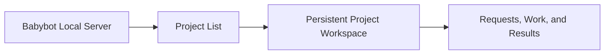

# Babybot Product

## Goal

Build a private personal assistant that helps one user complete ongoing work and
personal tasks.

Babybot maintains persistent projects, receives user requests, completes work,
and preserves reusable results for future tasks.

## Product Form

Babybot runs as one Local Server and uses the system browser as its interface.

The home page displays a list of projects. Each project has a persistent Web
workspace containing:

- conversation and user requests;
- goals, tasks, and progress;
- documents, code, data, and other results;
- execution status and required approvals; and
- project-specific pages and controls.

All projects share the same Babybot server, navigation, permissions, data, and
execution environment.

A desktop application can later wrap the Local Server and Web interface to
provide startup management, notifications, shortcuts, and native system access.

## Execution

For each request, Babybot selects one of the following paths:

1. generate a direct result;
2. run existing software;
3. combine existing software capabilities; or
4. use a coding agent to build or modify software.

The first coding backend uses the `SureD/kimi-code` fork. The coding backend is
replaceable and can later support Codex or other coding agents.

Babybot stores and maintains the software created for its projects. Reusable
software can be tested, versioned, updated, disabled, and rolled back.

## Token Efficiency

Babybot uses model tokens for new or uncertain work and uses software for
repeated work.

Babybot improves token efficiency through:

- reusing existing software before invoking a coding agent;
- converting repeatable workflows into executable code;
- loading only the context required by the current task;
- using smaller models for bounded tasks;
- using stronger models only for high-uncertainty decisions; and
- measuring token usage across creation, execution, and maintenance.

## Product Definition

Babybot is a local, project-based personal assistant.

Its entry point is a browser-based project list. Each project is a persistent
Web workspace. Babybot completes user requests by running existing software or
using a coding agent to create missing capabilities. Its primary optimization
target is reducing repeated model reasoning through reusable code.

Technical implementation is defined in [ARCHITECTURE.md](./ARCHITECTURE.md).
