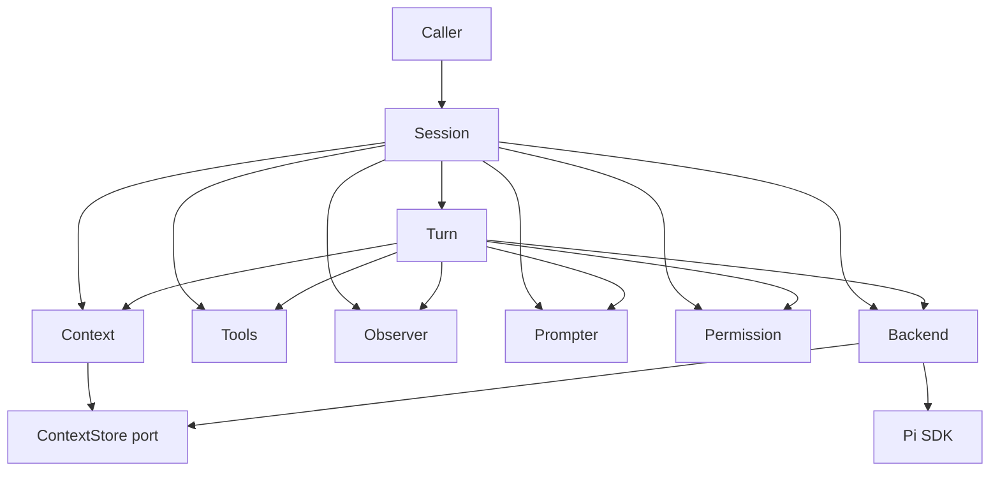
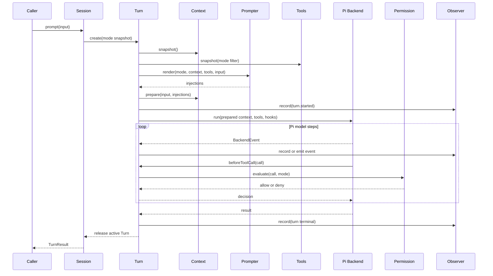

# DESIGN-001: Babybot Agent 基础层

| 字段 | 内容 |
| --- | --- |
| 设计编号 | DESIGN-001 |
| 状态 | Proposed，等待结构评审 |
| 范围 | Pi 之上的最小 Agent 封装 |
| 不包含 | Task、Goal、调度、生成工具、容器、自更新、产品 API |
| 主要参考 | MoonshotAI/kimi-code `ba64072559c1e9bb3447ede39991ac2e8bdb7645` |

## 1. 评审结论

提出的七个组件方向是合理的：

1. `Context`：管理模型可见的全部上下文。
2. `Turn`：管理一次用户输入到 Agent 停止之间的过程。
3. `Tools`：管理所有静态和动态注册的工具。
4. `Observer`：观测执行路径。
5. `Session`：组合组件并形成外部 API。
6. `Prompter`：为不同 mode 注入提示词。
7. `Permission`：在工具执行前作出权限决策。

需要做三点调整：

- 增加一个很薄的 `Backend` 端口隔离 Pi。它不是第八个业务组件，只负责
  防止其他模块直接依赖 Pi 类型。
- `Prompter` 只能影响模型行为，不能作为权限边界。比如 plan mode 除了
  注入提示，还必须由 `Permission` 禁止写操作。
- `Context` 是逻辑上的唯一上下文入口，但不在 Babybot 中复制一份 Pi
  transcript。Pi 继续负责 history 的物理存储和 compaction。

这七个组件先放在同一个 `@babybot/agent` package 中，而不是拆成七个
package。Pi adapter 继续位于 `@babybot/pi-backend`。

## 2. 组件关系

```text
Session
  ├─ Context
  ├─ Tools
  ├─ Observer
  ├─ Prompter
  ├─ Permission
  ├─ BackendSession (Pi adapter)
  └─ Active Turn (最多一个)
```



依赖规则：

- `Session` 只负责编排和生命周期。
- `Turn` 协调一次执行，但不实现 model loop；model loop 仍由 Pi 负责。
- `Tools` 不依赖 `Permission`；Turn 负责在执行工具前调用 Permission。
- `Prompter` 只读取 Context 和 Tools 的 snapshot。
- `Permission` 只读取 mode、tool definition 和调用参数。
- `Observer` 不参与任何决策，避免观测逻辑改变执行结果。
- 只有 `PiBackend` 可以导入 Pi SDK 类型。

组件使用目录作为代码边界。每个目录至少有独立的 `interface.ts`，并通过
自己的 `index.ts` 暴露模块 API；实现文件留在同一目录中，不把所有接口和
实现堆进少数几个顶层 `.ts` 文件。

```text
packages/agent/src/
  index.ts
  content.ts
  errors.ts
  context/
    interface.ts
    context.ts
    index.ts
  turn/
    interface.ts
    turn.ts
    index.ts
  tools/
    interface.ts
    tools.ts
    index.ts
  observer/
    interface.ts
    observer.ts
    index.ts
  prompter/
    interface.ts
    prompter.ts
    index.ts
  permission/
    interface.ts
    permission.ts
    index.ts
  session/
    interface.ts
    session.ts
    index.ts
  backend/
    interface.ts
    index.ts
```

文件职责：

- `interface.ts` 定义该模块拥有的接口、输入、输出和错误。
- 模块实现只依赖其他模块的 `interface.ts`，不依赖其具体实现。
- 模块 `index.ts` 是该模块的公开出口，不包含实现逻辑。
- `src/index.ts` 是 package 的公开出口，只暴露 Session API、工具注册 API
  以及调用者必须使用的公共类型。
- `content.ts` 和 `errors.ts` 只放跨模块基础值；不能演变成通用 `types.ts`。
- Pi Backend 只依赖 `backend/interface.ts` 以及必要的模块接口，不导入
  `packages/agent` 的具体实现。

## 3. Context

### 定义

`Context` 是所有 model-visible context 的唯一门面。其他模块不能绕过它
直接拼接 system prompt 或 messages。

Context 管理：

- Babybot 基础 system prompt；
- 项目指令，例如 `AGENTS.md`；
- conversation history；
- 用户和 Assistant messages；
- tool call 和 tool result；
- Prompter injections；
- steer、system reminder 和 compaction summary；
- token 使用量和 context window 信息。

### 主要职责

- 提供有序的 model-visible messages。
- 标记 context 内容的来源。
- 在 Turn 开始前生成不可变 snapshot。
- 合并 Prompter 生成的临时 injection。
- 提供 token usage、compact 和 clear 操作。
- 恢复时处理未闭合的 tool call。
- Context 变化后递增 revision。

### 不负责

- 不选择 mode。
- 不生成 mode prompt。
- 不判断权限或执行工具。
- 不重新实现 Pi history 和 compaction。
- 不向 SQLite 复制完整 transcript。

### 最小操作面

| 操作 | 语义 |
| --- | --- |
| `snapshot()` | 返回当前只读 Context snapshot |
| `prepare(turnInput, injections)` | 生成本 Turn 使用的 Prepared Context |
| `compact(instruction?)` | 请求底层执行 compaction |
| `clear()` | 清空当前 conversation context |

`prepare` 只生成只读视图，不提前把用户消息写入 transcript。Pi Backend
调用 `session.prompt(turnInput)` 后，由 Pi 更新真实 history，避免同一消息被
追加两次。

### 与 Pi 的边界

Babybot `Context` 是逻辑 owner；Pi 是 transcript 和 compaction 的物理
owner。Pi Backend 实现一个窄的 `ContextStore` 端口，Context 通过这个端口
读取 snapshot、compact 和 clear。

## 4. Turn

### 定义

一个 `Turn` 从 Session 接受一次输入开始，到 Agent 完成、失败或取消结束。
Turn 内可以包含多个 model step 和多个 tool call。

### 主要职责

- 分配稳定的 `turnId`。
- 固化本 Turn 的 mode、Context revision 和 Tool revision。
- 调用 Prompter 获取 injections。
- 调用 Context 生成 Prepared Context。
- 调用 Backend 驱动 Pi。
- 将 Backend 事件转换为稳定 Agent 事件。
- 在每次工具执行前调用 Permission。
- 将事件发送给 Observer。
- 聚合最终输出和本 Turn usage。
- 处理 cancel、steer 和终态。

### 不负责

- 不实现模型循环。
- 不持久化 Session history。
- 不维护 Tool registry。
- 不定义 plan/build mode 的内容。
- 不允许运行中切换 mode 或 Tool snapshot。

### 最小操作面

| 操作 | 语义 |
| --- | --- |
| `run(input)` | 启动 Turn，并返回事件流与最终结果 |
| `steer(input)` | 将新输入注入当前 Turn |
| `cancel(reason?)` | 取消当前 Turn |

状态机保持简单：

```text
created -> running -> completed
                   -> failed
                   -> cancelled
```

### 与 Pi 事件的映射

本文采用 kimi-code 的 Turn 语义。Pi 的命名不同：

| Pi 事件 | 本文语义 |
| --- | --- |
| `agent_start` / `agent_end` | 一个 Turn 的开始和结束 |
| `turn_start` / `turn_end` | Turn 内部的一次 model step |
| `tool_execution_*` | step 内部的工具调用 |

Pi 的 model step 不应该在 Babybot API 中再次命名为 Turn。

## 5. Tools

### 定义

`Tools` 就是一个 Session 能使用的所有工具的集合和注册中心。不再定义一个
范围更大的 Tool Runtime。

它统一管理：

- Pi builtin tools；
- Babybot native tools；
- 运行时动态注册的 tools；
- 未来的 MCP tools；
- 未来的 generated tools。

静态和动态表示注册生命周期：

- `static`：Session 创建时注册，Session 生命周期内不能删除或覆盖。
- `dynamic`：运行时可以注册、替换或删除。

### 主要职责

- register、replace、unregister、get 和 list。
- 管理 enabled/disabled 状态。
- 检查名称和 version 冲突。
- 为每个 Turn 生成不可变 Tool snapshot。
- 校验 hosted tool 输入。
- 分发 hosted tool 执行。
- 保留 source、version、lifetime 和 execution type。

### 不负责

- 不作权限决策。
- 不选择 mode。
- 不管理 Context。
- 不记录调用路径。

### 最小操作面

| 操作 | 语义 |
| --- | --- |
| `register(tool)` | 注册新工具，重名时失败 |
| `replace(tool)` | 只允许替换 dynamic tool |
| `unregister(name)` | 只允许删除 dynamic tool |
| `enable/disable(name)` | 修改后续 Turn 的可见性 |
| `list/get` | 查询注册信息 |
| `snapshot(filter?)` | 固化一个 Turn 的有效工具集合 |
| `invoke(name, call)` | 执行 hosted tool |

必须满足：

- 一个 snapshot 内 model-visible name 唯一。
- dynamic 变更只影响下一个 Turn。
- Pi builtin 由 Pi 执行，hosted tool 由 Tools 执行。
- 所有工具，包括 Pi builtin，都必须先经过 Permission。

## 6. Observer

### 定义

`Observer` 是 Agent 内部唯一的事件出口，用来观察 Turn、model step、tool
call、permission 和 context 变化。

### 主要职责

- 为结构事件分配 Session 内单调递增的 sequence。
- 保证结构事件先记录再发布。
- 发布实时 delta 和 progress。
- 隔离普通 listener 的异常。
- 让 UI、日志、测试和未来 trace storage 使用同一事件源。

### 两类事件

- `record`：Turn 边界、tool call/result、permission decision、错误。
- `emit`：text delta、thinking delta、tool progress。

`record` 失败时无法保证路径完整，Turn 应失败；`emit` listener 失败不能
影响 Turn。Observer 不得修改事件、阻止工具或改变 Turn 状态。

### 最小操作面

| 操作 | 语义 |
| --- | --- |
| `record(event)` | 持久/结构事件，返回带 sequence 的事件 |
| `emit(event)` | best-effort 实时事件 |
| `subscribe(listener)` | 注册观察者并返回 unsubscribe |

第一阶段不引入 OpenTelemetry span、产品 Task trace 或复杂 event sourcing。
事件只需要 Session ID、Turn ID、toolCallId、sequence 和 payload。

## 7. Prompter

### 定义

`Prompter` 根据当前 mode 和 Turn 信息生成显式 prompt injection。它不是完整
Context，也不存 conversation history。

### 主要职责

- 注册 mode 对应的 prompt contributor。
- 根据 mode、Context snapshot、Tool snapshot 和用户输入生成 injections。
- 标记 injection 的来源和插入位置。
- 保证相同输入得到确定的输出。

### 不负责

- 不直接修改 Pi history。
- 不执行或隐藏工具。
- 不判断权限。
- 不负责 mode 的持久化和切换时机。

### 最小操作面

| 操作 | 语义 |
| --- | --- |
| `render(mode, context, tools, input)` | 返回有序 Prompt injections |

Injection 的位置首版只需要：

- `system-append`；
- `turn-prefix`；
- `turn-suffix`。

## 8. Permission

### 定义

`Permission` 在工具参数已经解析、但工具尚未执行时作出决定。它必须同时
覆盖 Pi builtin 和 hosted tool。

### 主要职责

- 按顺序执行 permission policies。
- 返回 `allow`、`deny` 或 `ask`。
- 支持按 tool name、source、mode 和参数匹配。
- 对 `ask` 调用外部 Approval Provider。
- 返回 policy、reason 和最终决定，由 Turn 记录到 Observer。
- 对 deny 生成模型可理解的 tool error，防止模型假设调用成功。

### 不负责

- 不依赖 prompt 保证权限。
- 不执行工具。
- 不修改 Tool registry。
- 不实现 Web 审批 UI。

### 最小操作面

| 操作 | 语义 |
| --- | --- |
| `evaluate(mode, toolCall, signal)` | 返回最终 allow 或 deny |
| `addPolicy(policy)` | 增加有顺序的策略 |
| `removePolicy(name)` | 删除动态策略 |

Policy 采用 first-match 语义，最后必须有明确 fallback。V1 为保持当前产品
行为，可以在 default/build mode 默认允许已启用工具；plan mode 对写操作
明确 deny。接口保留 `ask`，但第一阶段不要求实现审批 UI。

Pi 提供 programmatic `ExtensionFactory` 和可阻止执行的 `tool_call` hook。
Pi Backend 应安装 Babybot 自有的 permission hook，将调用转给 Permission。
这不等于开启项目 extension 自动发现；extension、skill 和 prompt-template
自动发现仍保持关闭。

## 9. Mode 如何组合三个组件

Mode 是配置，不单独成为组件。每个 mode 同时包含：

| 配置 | 执行者 |
| --- | --- |
| Prompt injections | Prompter |
| Tool filter | Tools |
| Permission policy set | Permission |

例如 plan mode：

- Prompter 注入“分析并输出计划”；
- Tools 隐藏明显不需要的 mutation tools；
- Permission 拒绝写文件和有副作用的 Bash 调用。

不能只实现第一项，否则 plan mode 只是模型建议，不是运行时约束。

首版 mode 建议只有：

- `default`：普通对话和混合任务。
- `plan`：只分析和制定计划。
- `build`：允许按正常规则修改工作区。

## 10. Session

### 定义

`Session` 是外部唯一需要使用的 Agent API，也是其他模块的生命周期 owner。
它只组合组件，不重新实现组件内部逻辑。

### 主要职责

- 创建或恢复 Pi BackendSession。
- 创建并持有 Context、Tools、Observer、Prompter 和 Permission。
- 保证一个 Session 最多只有一个 active Turn。
- 创建 Turn 并返回 TurnHandle。
- 管理当前 mode；mode 只在 Turn 边界切换。
- 暴露动态工具注册、事件订阅、compact、cancel 和 close。
- close 时取消 active Turn 并释放 Backend。

### 不负责

- 不实现 Context message ordering。
- 不执行工具。
- 不定义 permission policies。
- 不生成 prompt 内容。
- 不翻译 Pi 事件。

### 对外 API 草案

```ts
interface AgentSession {
  readonly id: string;
  readonly mode: 'default' | 'plan' | 'build';

  prompt(input: TurnInput): Promise<TurnHandle>;
  setMode(mode: AgentMode): Promise<void>;

  registerTool(tool: ToolRegistration): void;
  replaceTool(tool: ToolRegistration): void;
  unregisterTool(name: string): boolean;

  contextSnapshot(): Promise<ContextSnapshot>;
  compact(instruction?: string): Promise<void>;
  subscribe(listener: AgentEventListener): () => void;

  cancel(reason?: string): Promise<void>;
  close(): Promise<void>;
}
```

这里的类型只表示 API 形状，具体字段在各组件实现 thread 中定义。

当 active Turn 存在时：

- 再次 `prompt` 返回 `session.busy`，首版不做隐式队列。
- `setMode` 和 Tool registry 变更返回 `session.busy`。
- `steer` 只能通过当前 TurnHandle 调用。

队列应属于 Agent 之上的 orchestration，而不是这个基础层。

## 11. Backend 端口

Backend 只处理 Pi 适配，不形成新的领域概念。

### 最小操作面

| 操作 | 语义 |
| --- | --- |
| `open(config)` | 创建或恢复 Pi session |
| `run(turnInput)` | 驱动一个 Pi Agent run |
| `steer(input)` | 转发到 Pi steer |
| `abort()` | 取消当前 Pi run |
| `compact(instruction?)` | 调用 Pi compaction |
| `contextStore()` | 暴露窄 ContextStore port |
| `close()` | dispose Pi session |

Pi Backend 负责：

- 创建/恢复 Pi AgentSession；
- 将 Context、Tools 和 hooks 映射到 Pi SDK；
- 通过 programmatic extension hook 执行 Permission；
- 转换 Pi 事件；
- 调用 Pi 的 prompt、steer、abort、compact 和 dispose。

Pi Backend 不负责 mode、Tool registry、Permission policy、prompt 内容和
外部 Session API。

## 12. 完整调用流程



## 13. 必须保持的约束

1. 一个 Session 同时最多一个 Turn。
2. 一个 Turn 的 mode、Context revision 和 Tool revision 启动后不可变化。
3. 所有 model-visible 内容必须经过 Context。
4. 所有 prompt injection 必须来自 Prompter 并带来源。
5. 所有工具必须先注册到 Tools 才能暴露给模型。
6. 所有工具调用，包括 Pi builtin，都必须先经过 Permission。
7. Permission deny 必须发生在副作用之前。
8. Observer 不能修改执行控制流。
9. Pi 类型不能离开 Pi Backend。
10. Babybot 不复制 Pi transcript，也不重新实现 Pi model loop。
11. Prompt 约束不能替代 Permission 约束。
12. 自动 extension、skill 和 prompt-template discovery 保持关闭。

## 14. 已确定的设计选择

| 问题 | 决定 |
| --- | --- |
| 七个组件是否合理 | 合理，增加一个非领域 Backend port |
| Context 是否包含 history | 包含逻辑视图，物理存储仍由 Pi 管理 |
| Tools 的范围 | 所有 static/dynamic、builtin/hosted 工具 |
| Tools 是否负责权限 | 否，Permission 独立 |
| Prompter 是否能保证 plan 只读 | 否，必须配合 Permission |
| Session 是否包含队列 | 否，busy 时明确失败 |
| Turn 是否实现 agent loop | 否，Pi 实现 |
| Observer 是否能阻止执行 | 否 |
| 一个 Turn 中能否改变 mode/tools | 否，下一个 Turn 生效 |

## 15. 后续独立实现顺序

1. `Observer`：先固定最小事件契约。
2. `Tools`：实现 static/dynamic registry 和 snapshot。
3. `Permission`：通过 Pi `tool_call` hook 验证 builtin/hosted 都可阻止。
4. `Prompter`：实现 default/plan/build injections。
5. `Context`：在不复制 transcript 的前提下封装 Pi ContextStore。
6. `Turn`：组合一次执行、事件、取消、steer 和 usage。
7. `Session`：形成最终公共 API 和生命周期管理。
8. Pi Backend contract tests：确认 Pi 类型没有泄漏。

每个组件在独立 thread 中补充详细数据结构、错误模型和 contract tests；当前
文档不提前决定这些实现细节。

## 16. 本文明确不解决的问题

- Project、Task、Goal 和 scheduler。
- Web/SSE API 和 SQLite schema。
- 多 Session 并发和任务队列。
- MCP 连接生命周期。
- generated tool 的构建、验证和隔离。
- 容器或 VM runtime。
- 长期 memory 和知识检索。
- Babybot 自更新。

## 17. 参考

- [kimi-code Agent Context](https://github.com/MoonshotAI/kimi-code/tree/ba64072559c1e9bb3447ede39991ac2e8bdb7645/packages/agent-core/src/agent/context)
- [kimi-code TurnFlow](https://github.com/MoonshotAI/kimi-code/blob/ba64072559c1e9bb3447ede39991ac2e8bdb7645/packages/agent-core/src/agent/turn/index.ts)
- [kimi-code ToolManager](https://github.com/MoonshotAI/kimi-code/blob/ba64072559c1e9bb3447ede39991ac2e8bdb7645/packages/agent-core/src/agent/tool/index.ts)
- [kimi-code Permission](https://github.com/MoonshotAI/kimi-code/tree/ba64072559c1e9bb3447ede39991ac2e8bdb7645/packages/agent-core/src/agent/permission)
- [kimi-code stateless loop contract](https://github.com/MoonshotAI/kimi-code/blob/ba64072559c1e9bb3447ede39991ac2e8bdb7645/packages/agent-core/src/loop/README.md)
- [Earendil Pi SDK embedding API](https://github.com/earendil-works/pi/tree/main/packages/coding-agent)
